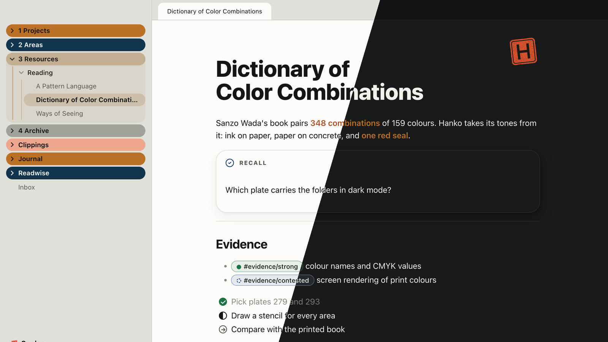
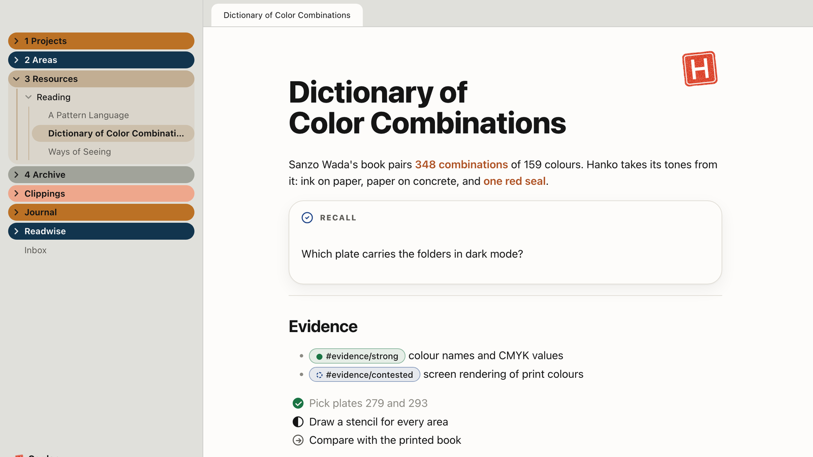
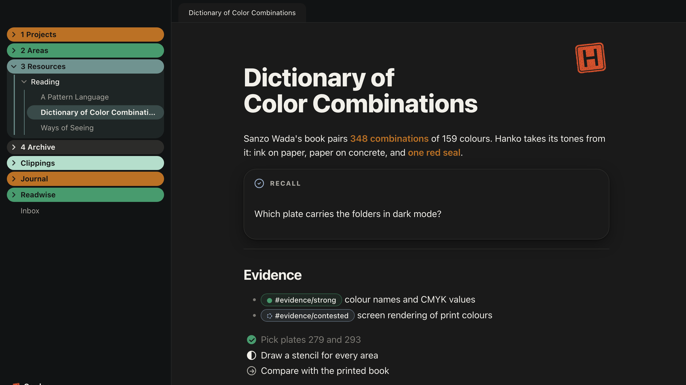

# Hanko

Ink on paper, paper on concrete, and exactly one red mark: the seal.

Hanko is an Obsidian theme named after the Japanese name seal. Almost everything is ink on paper; colour has a job or it stays away. The tones come from Sanzo Wada's *A Dictionary of Color Combinations*.

## What it does

- **Paper on concrete.** Notes sit on paper, everything around them on a concrete ground (light) or Wada's Black (dark).
- **Folders on a Wada plate.** Top-level folders become solid pills in the colours of plate No. 279 (light) and No. 293 (dark). Raw Sienna is the anchor and always comes first. The colour follows the first character of the folder name, so it stays put while you scroll. Folders whose name contains "archive" turn grey.
- **The seal.** A stamped name seal with uneven ink. It appears on notes you sign off with `cssclasses: seal`, on the empty tab and next to the vault name. Swap `--hanko-siegel` in a snippet to use your own mark.
- **Bold in the anchor colour.** Bold text is Burnt Sienna in light mode and Raw Sienna in dark mode. Indigo, red, umber, plum, green and plain ink are available.
- **Readable everywhere.** Every text and background pair reaches at least 4.5:1, in light and dark.
- **No network requests.** Everything, including the seal, is embedded.

## Note building blocks

| You write | You get |
|---|---|
| `cssclasses: seal` | the seal at the top right of the note |
| `cssclasses: focus` | focus mode: only the paragraph with the cursor stays in full ink |
| `cssclasses: daily-page`, `weekly-page`, `monthly-page` | the note title large, with a small label and a red dot above it |
| `> [!days]` with a list of links | the days of a week as a row of cards |
| `#evidence/strong`, `partial`, `contested`, `untestable`, `refuted` | evidence levels as pills: full circle, half circle, dashed ring, dotted ring, slashed ring |
| `#status/active`, `waiting`, `someday`, `done` | status pills: full circle, clock, dotted ring, check |
| `- [>]` `- [<]` `- [/]` `- [-]` `- [?]` `- [!]` | Bullet Journal task states: migrated, scheduled, in progress, cancelled (grey, never struck through), question, now |
| `> [!recall]`, `[!review]`, `[!opinion]`, `[!ask]`, `[!correct]`, `[!upfront]`, `[!answer]`, `[!exercise]` | role callouts; recall, upfront and exercise are raised cards because you answer them |

Footnotes turn into a "Sources" list with hairlines and a red bar on the entry you jumped to.

## Plugin support

Bases (tables and cards), Kanban (lanes and cards), Canvas, Keep the Rhythm (heatmap in Wada greens), Home Tab (the seal replaces the logo), Readwise (highlights as cards), Tasks, Iconize, Style Settings.

## Style Settings

Install [Style Settings](https://github.com/mgmeyers/obsidian-style-settings) to change:

- **Seal:** on every note, hidden everywhere, without the stamping motion
- **Colour:** bold text colour, folder plate in light mode (No. 279 or No. 327), no folder colours, soft folder colours
- **Focus:** one task in view
- **Form:** hairline above H2, callout titles, glass, status bar, scrollbars

## Screenshots

| Light | Dark |
|---|---|
|  |  |

## Credits

- Colours: Sanzo Wada, *A Dictionary of Color Combinations* (Seigensha), via the digital data set by Matt DesLauriers: [mattdesl/dictionary-of-colour-combinations](https://github.com/mattdesl/dictionary-of-colour-combinations). Hex values are converted from the book's CMYK values, so printed colours look different.
- Folder colours inspired by the Soft Paper theme.

## License

[MIT](LICENSE) © 2026 Michael Doroszewski
